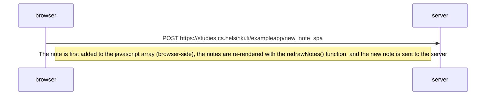

```mermaid
sequenceDiagram
    participant browser
    participant server

    browser->>server: POST https://studies.cs.helsinki.fi/exampleapp/new_note_spa
    Note right of browser: The note is first added to the javascript array (browser-side), the notes are re-rendered with the redrawNotes() function, and the new note is sent to the server 
```
